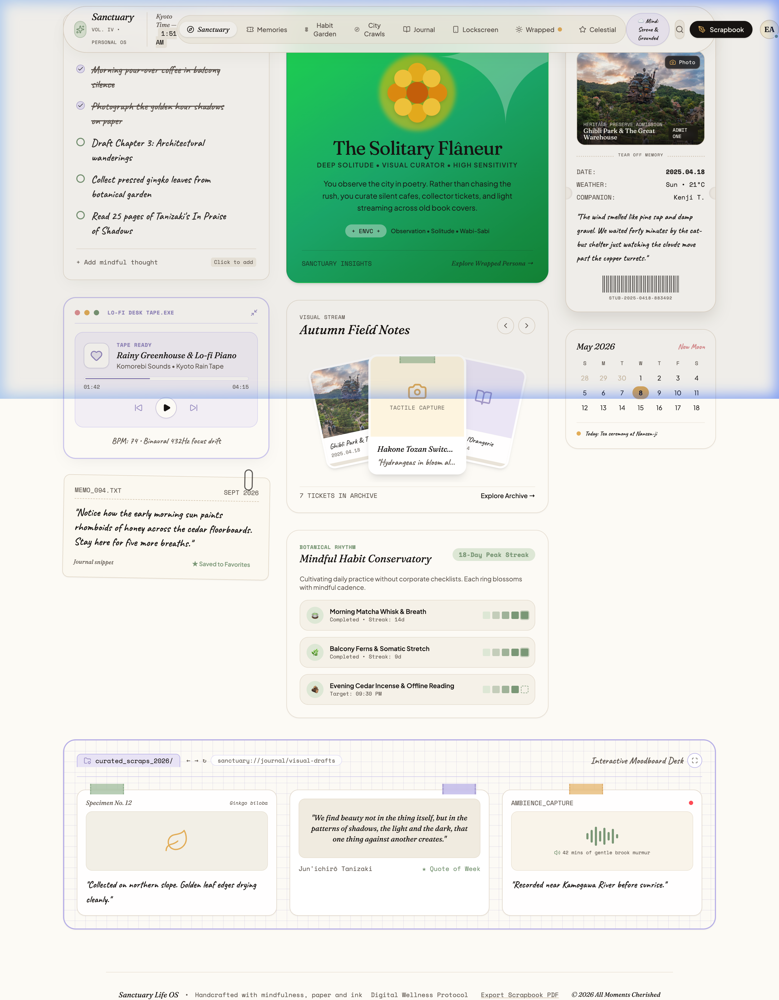
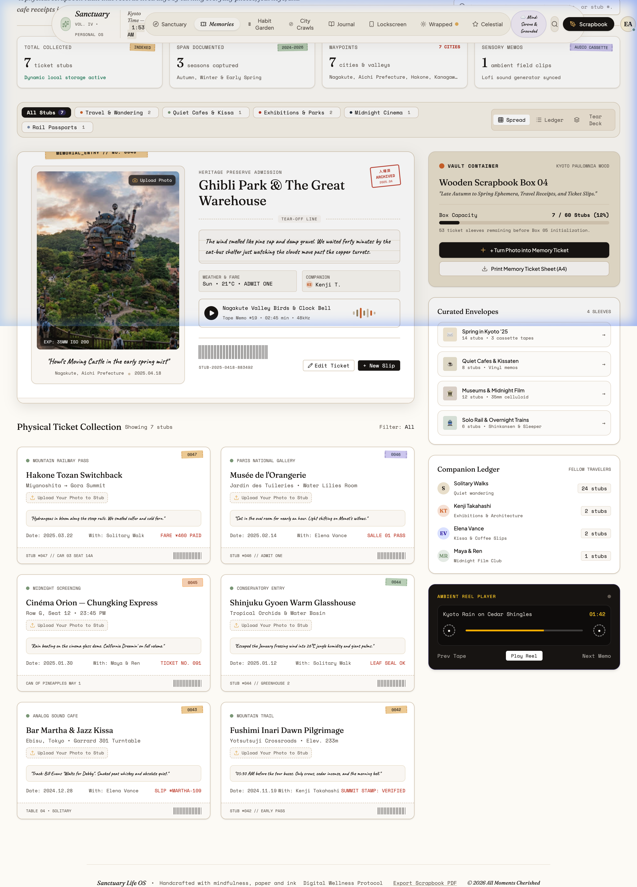
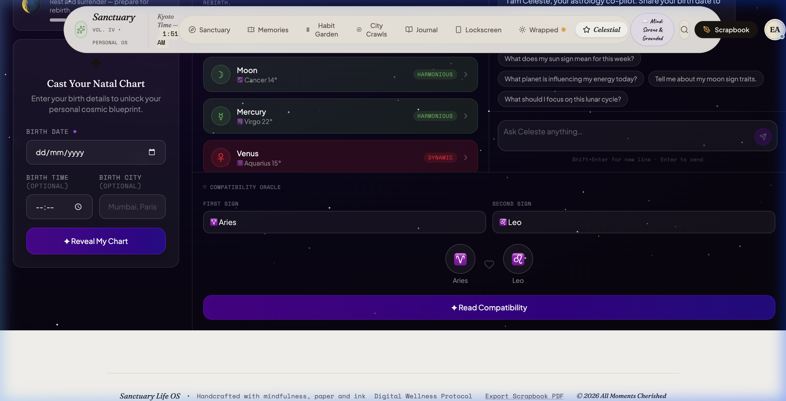
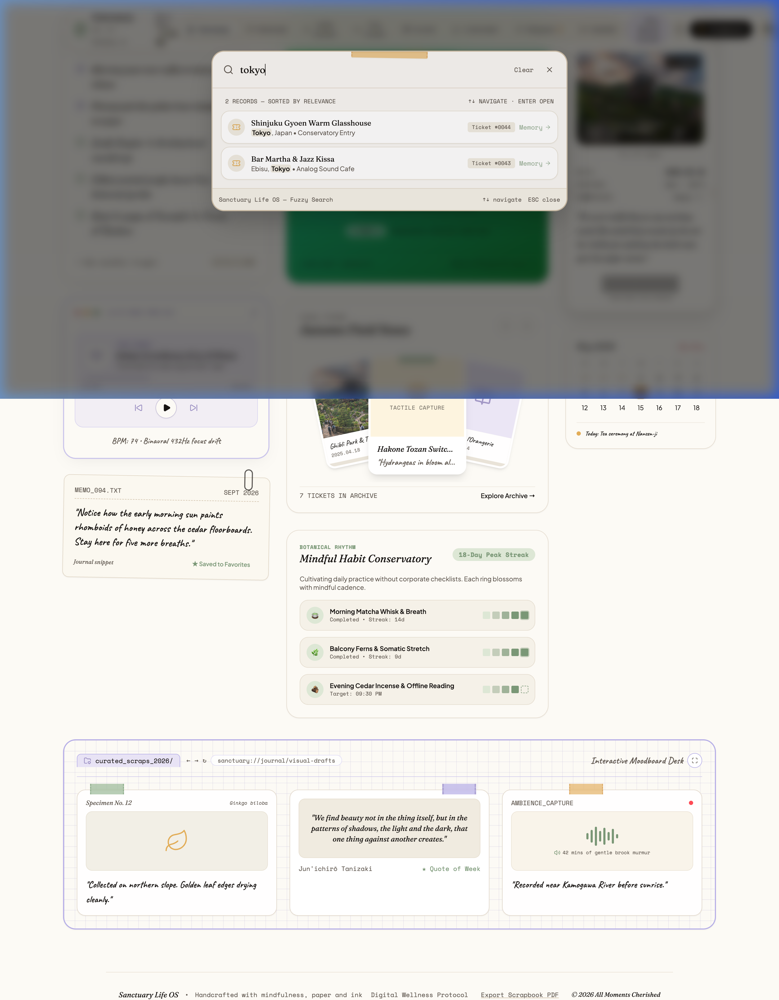

<p align="center">
  
</p>

<h1 align="center">✦ LIFE-OS — Sanctuary Personal Journal</h1>

<p align="center">
  <strong>A beautifully crafted, AI-powered personal life operating system</strong><br/>
  Capture memories · Build habits · Journal your journey · Navigate the cosmos
</p>

<p align="center">
  <a href="https://life-os-33c6b.web.app"><strong>🌐 Live Web App →</strong></a>
  &nbsp;•&nbsp;
  <a href="https://lifeos-backend-1037752492960.us-central1.run.app/health"><strong>⚡ Cloud Run API →</strong></a>
  &nbsp;•&nbsp;
  <a href="#-features">Features</a>
  &nbsp;•&nbsp;
  <a href="#-tech-stack">Stack</a>
  &nbsp;•&nbsp;
  <a href="#-local-development">Local Dev</a>
  &nbsp;•&nbsp;
  <a href="#-firebase-deploy">Deploy</a>
</p>

---

## 🌿 What is LIFE-OS?

LIFE-OS is a premium, full-stack personal journal application that goes far beyond a simple diary. It's your complete digital sanctuary — beautifully designed with a warm paper-and-washi-tape aesthetic, powered by Google's Gemini AI, and backed by Firebase.

Think of it as a personal operating system for your inner life: track what matters, reflect on your journey, form meaningful habits, discover your cosmic blueprint, and let AI surface insights from your own archives.

---

## ✨ Features

### 🏠 Sanctuary Home
Your daily dashboard — intentions, archetype reflection, memory highlights, and a curated stream of field notes.

### 🎟️ Memories Vault
Store life experiences as beautiful ticket stubs — travel, concerts, cafes, cinema. Rich with photos, companions, quotes, and washi-tape decorations.

<p align="center">
  
</p>

### 🌱 Habit Garden
Track daily rituals with streak heatmaps, weekly views, and gentle habit-forming nudges.

### 🗺️ City Crawls Passport
Document urban adventures as passport checkpoints with location details, stamps, and companion comments.

### 📓 Journal Desk
A full-featured journal with multiple paper styles (lined, grid, torn, scalloped), mood tagging, and AI-powered "Yap" reflection prompts.

### 🌟 Celestial Compass — Zodiac Co-pilot *(new!)*
Your personal AI astrology companion powered by Gemini.

<p align="center">
  
</p>

- **Natal Birth Chart SVG** — animated chart wheel with planet glyphs, aspect lines, and house divisions
- **Daily Transits** — real-time planetary positions with rich interpretations and energy labels
- **Moon Phase Tracker** — current phase, illumination, ritual suggestion
- **Celeste AI Chat** — ask anything about your chart, transits, or cosmic journey
- **Compatibility Oracle** — enter any two signs for a detailed synastry reading with strengths + growth areas
- **Responsive** — full 2-column layout on desktop, mobile-first tab navigation on phone

### 🔍 Fuzzy Command Palette *(upgraded!)*
Instant global search across all your life records.

<p align="center">
  
</p>

- **Fuzzy matching** — typo-tolerant, finds results even with misspellings
- **Relevance scoring** — best matches surface first (exact → word-start → contains → fuzzy)
- **Keyboard navigation** — ↑↓ arrows, Enter to jump, Escape to close
- **Match highlighting** — matched portions bolded in results
- **Debounced** — 180ms debounce for smooth, no-lag typing

### 📱 Lockscreen Packs
Curated aesthetic wallpaper packs with music pairing suggestions.

### 🗓️ Year Wrapped
Your annual life summary — cities walked, moments archived, presence quotient.

---

## 🔒 Security Architecture

```
Client (React)  →  [Firebase Auth]  →  Express API (Cloud Run)  →  Firestore
                                              ↕
                                      Firebase Admin SDK
                                      (bypasses client rules)
```

- **Firestore Security Rules** — default-deny, every path scoped to `request.auth.uid`
- **Admin SDK** — backend writes bypass client rules; only the authenticated server touches core data
- **Secret Manager** — API keys never exposed in frontend; fetched server-side at runtime
- **Rate limiting** — AI endpoints limited per-IP per-hour

---

## 🛠️ Tech Stack

| Layer | Technology |
|-------|-----------|
| **Frontend** | React 18 + TypeScript + Vite |
| **Styling** | Vanilla CSS + Tailwind CSS utility classes |
| **State** | Custom React Context store (`lifeOSStore`) |
| **Icons** | Lucide React |
| **Backend** | Node.js + Express (Cloud Run) |
| **Database** | Cloud Firestore |
| **Auth** | Firebase Authentication |
| **AI** | Google Gemini 2.0 Flash (`@google/genai`) |
| **Hosting** | Firebase Hosting (frontend) + Cloud Run (backend) |
| **Secrets** | Google Secret Manager |
| **Astrology** | Custom ephemeris engine (`src/lib/astrology.ts`) |

---

## 📸 More Screenshots

| Sanctuary Home | Zodiac Copilot |
|---|---|
|  |  |

| Fuzzy Search | Memories Vault |
|---|---|
|  |  |

---

## 🚀 Local Development

### Prerequisites
- Node.js 18+
- Firebase project (`life-os-33c6b`)
- Gemini API key

### 1. Clone & install

```bash
git clone https://github.com/chourasiavinit9-dev/Personal-Journal-.git
cd Personal-Journal-
npm install
cd backend && npm install && cd ..
```

### 2. Configure environment

**Frontend** — create `.env.local`:
```env
VITE_FIREBASE_API_KEY=your_firebase_web_api_key
VITE_FIREBASE_AUTH_DOMAIN=life-os-33c6b.firebaseapp.com
VITE_FIREBASE_PROJECT_ID=life-os-33c6b
VITE_FIREBASE_STORAGE_BUCKET=life-os-33c6b.appspot.com
VITE_FIREBASE_MESSAGING_SENDER_ID=523793100270
VITE_FIREBASE_APP_ID=your_app_id
VITE_API_URL=http://localhost:8088
```

**Backend** — create `backend/.env`:
```env
PORT=8088
GEMINI_API_KEY=your_gemini_api_key
FRONTEND_URL=http://localhost:5173
FIREBASE_PROJECT_ID=life-os-33c6b
```

### 3. Run (frontend + backend together)

```bash
npm run dev:all
```

Or separately:
```bash
npm run dev          # frontend only (port 5173)
npm run dev:backend  # backend only (port 8088)
```

---

## 🔥 Firebase Deploy

### Deploy Firestore Rules

```bash
npx -y firebase-tools@latest deploy --only firestore:rules --project life-os-33c6b
```

### Deploy Frontend to Firebase Hosting

```bash
npm run build
npx -y firebase-tools@latest deploy --only hosting --project life-os-33c6b
```

### Full deploy (rules + hosting)

```bash
npm run build
npx -y firebase-tools@latest deploy --project life-os-33c6b
```

**Live URL:** [https://life-os-33c6b.web.app](https://life-os-33c6b.web.app)

---

## 📁 Project Structure

```
Personal-Journal-/
├── src/
│   ├── components/
│   │   ├── tabs/
│   │   │   ├── SanctuaryHome.tsx       # Daily dashboard
│   │   │   ├── MemoriesVault.tsx       # Ticket stub archive
│   │   │   ├── HabitGarden.tsx         # Streak tracker
│   │   │   ├── CityCrawlsPassport.tsx  # Urban adventure log
│   │   │   ├── JournalDesk.tsx         # Full-featured journal
│   │   │   ├── ZodiacCopilot.tsx       # ✨ Astrology tab (new)
│   │   │   ├── LockscreenView.tsx      # Wallpaper packs
│   │   │   └── YearWrapped.tsx         # Annual summary
│   │   ├── Header.tsx
│   │   ├── CommandPaletteModal.tsx     # ✨ Upgraded fuzzy search
│   │   └── ...
│   ├── lib/
│   │   ├── astrology.ts                # ✨ Ephemeris + zodiac engine (new)
│   │   ├── api.ts                      # Auth-injected API fetcher
│   │   └── firebase.ts                 # Firebase client config
│   ├── store/
│   │   └── lifeOSStore.tsx             # ✨ Enhanced search store
│   └── types.ts
├── backend/
│   ├── src/
│   │   ├── routes/
│   │   │   ├── yap.js                  # AI journal reflection
│   │   │   ├── insights.js             # Memory insights
│   │   │   ├── memories.js             # Memory CRUD
│   │   │   └── astro.js                # ✨ Celeste AI astrology (new)
│   │   ├── middleware/auth.js
│   │   ├── services/secrets.js
│   │   └── app.js
│   └── package.json
├── docs/screenshots/                   # App screenshots
├── firestore.rules
├── firebase.json
└── README.md
```

---

## 🌌 Astrology Engine

The Zodiac Co-pilot uses a custom lightweight ephemeris (`src/lib/astrology.ts`) — no external astronomy library needed:

- **Simplified Keplerian mechanics** from J2000.0 epoch — accurate to ±2–3° for entertainment use
- Sun sign calculation: includes equation of centre correction
- Moon sign: mean motion from J2000 baseline
- Rising sign: RAMC approximation (requires birth time)
- **Aspects**: Conjunction, Sextile, Square, Trine, Opposition with configurable orbs
- **Compatibility**: Element + quality + sign position scoring (0–100%)
- **Moon phase**: Calculates from Sun–Moon longitude difference

---

## 🤝 Contributing

This is a personal project, but PRs are welcome! Please:
1. Fork the repo
2. Create a feature branch (`git checkout -b feature/your-feature`)
3. Commit your changes
4. Open a pull request

---

## 📄 License

Apache 2.0 — see [LICENSE](LICENSE)

---

<p align="center">
  <em>Built with ♥ and a touch of stardust · Powered by Google Gemini & Firebase</em><br/>
  <strong><a href="https://life-os-33c6b.web.app">life-os-33c6b.web.app</a></strong>
</p>
